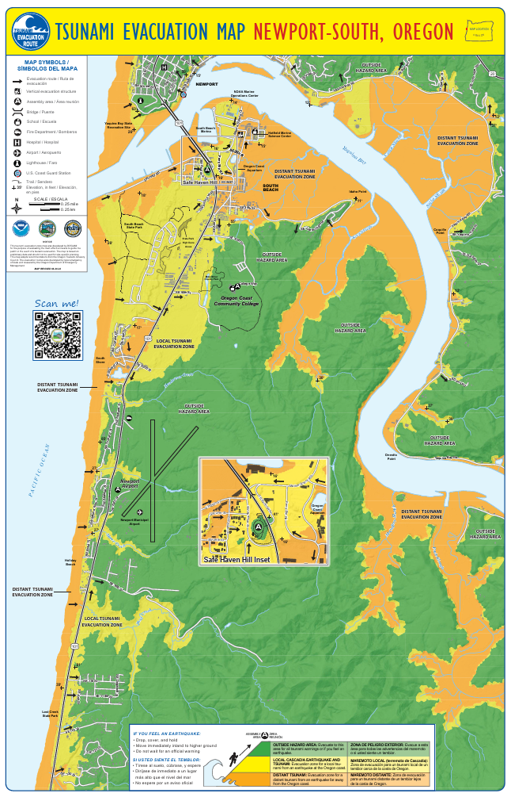
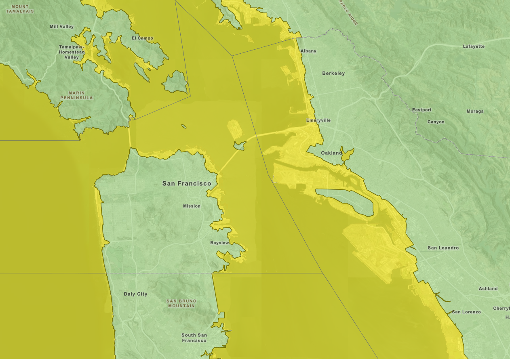
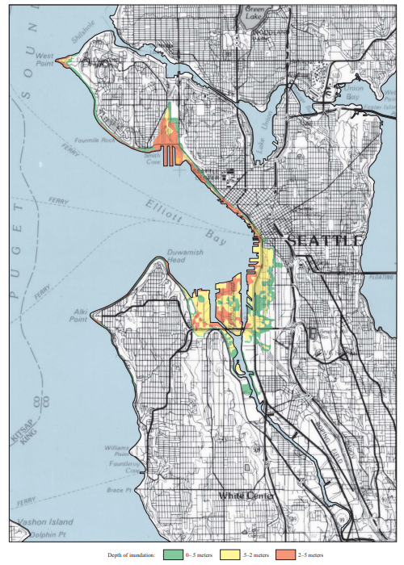

## Tsunamis – What to do in port
* When you’re in port (before, in between, or after a leg of the cruise) it is important to familiarize yourself with potential tsunami evacuation routes depending on where you are.
* Before you go on a planned outing, familiarize yourself with where you will be on the map and the best route for evacuation.
* Potential threats from a tsunami can vary drastically, so a little planning can go a long way to ensure the safety of oneself, and those around you.
* Maps are provided below for common ports. Make note of the docking location for the ship.
* Links are also provided for an online version of each port’s tsunami evacuation map.

::: {.panel-tabset}

### Newport, OR Tsunami Evacuation
* The map below is separated into Newport-North and Newport-South, with the Newport-North map for when you are north of the Yaquina Bay Bridge, and Newport-South for when you are south of the bridge.
* The ORANGE regions on the map represent the area that must be evacuated if there is a distant tsunami, in which the earthquake occurs far from the Oregon Coast.
* The YELLOW regions on the map represent the area that must be evacuated if there is a local Cascadia earthquake and tsunami that occurs on the Oregon Coast.
* The GREEN regions on the map represent the area that is outside the hazard area. Evacuate to the green if you there is a tsunami warning, if you feel an earthquake, OR if you are unsure about the risk for any reason.
* Remain in the evacuation zone until you are notified by authorities that it is safe to leave
* This [link](https://www.newportoregon.gov/emergency/evacmaps.asp) will take you to the same maps seen below. It will allow you to zoom in to identify where you are and evacuation areas around you.

::: {layout-ncol=2}

{width="60%"}

{width="60%"}

:::

### San Francisco, CA Tsunami Evacuation
* The map below does not provide as much detail as the Newport, OR map. 
* The link below will take you to the same map that is interactive. This allows you to identify your location and evacuation areas around you in greater detail than the map. 
* Wherever you might be in San Francisco, you will be less than 10 blocks from a safe area should a Tsunami occur. 
* The YELLOW on the map represents a tsunami hazard area and should be evacuated if you feel an earthquake, if you are given a tsunami warning, OR if you are unsure of the situation. 
* The GREEN on the map represents safe evacuation locations. 
* As San Francisco is a large city, if a localized earthquake/tsunami event were to occur, you should be aware of the dangers associated with evacuating to an area that has large buildings and other vulnerable structures. 
* Refer to this [link](https://maps.conservation.ca.gov/cgs/informationwarehouse/ts_evacuation/?extent=-13638549.0627%2C4536570.1047%2C-13622115.1016%2C4554762.1174%2C102100&utm_source=cgs+active&utm_content=sanfrancisco) for a much more detailed, interactive map to plan your safe evacuation route.

### Seattle, WA Tsunami Evacuation
* Due to the terrain in and around Seattle, you are not far from safety should an earthquake/tsunami occur. 
* The map on the next page provides a different look at the tsunami hazard zones in Seattle. This map was created to show the potential levels of inundation from a tsunami associated with an earthquake along the Seattle Fault. As you can see, areas that have an inlet or cove represent the highest threat of inundation from a tsunami. 
* The GREEN on the map represents areas where inundation from a tsunami could be 0-0.5 meters. The YELLOW on the map represents areas where inundation from a tsunami could be 0.5-2.0 meters. The ORANGE on the map represents areas where inundation from a tsunami could be 2.0-5.0 meters. 
* While this map doesn’t actually show you where to go if a tsunami were to occur, it is an important reference depicting areas to avoid should an event occur. Should an earthquake, tsunami warning, or uncertainty involving an earthquake/tsunami occur, your first priority is to head for higher ground. 
* Follow this [link](https://www.pmel.noaa.gov/pubs/PDF/wals2794/wals2794.pdf) to find out more information about a potential earthquake/tsunami in Seattle.

:::

## Chemicals
Read the SDS for the chemicals (available in the Chem Lab, with the Chief Scientist in the Safety Binder, and in the Spill Kit) and make sure you know where they are in case you need to use them!

### General Information
Typical chemicals brought on board are 37% formaldehyde and 95% ethanol. They need to be diluted. Follow the instructions below.

Spill kits are available in the Chem Lab as well as a NWFSC-provided kit in the Wet Lab. Eyewash stations are also available in the Chem Lab and Wet Lab.

::: {.panel-tabset}

### Formalin
***Diluting***

* Most of the time, the formalin has to be diluted from containers of 37% concentration formaldehyde (100% formalin) to 10% formalin (~4% formaldehyde). To mix, **use 9 parts seawater to 1 part formaldehyde.** Seawater is used because the salt acts as a buffer.
* Wear full raingear, eye protection, and gloves to mix.
* While pouring the seawater and formalin into the container, do so slowly to minimize any splashing, and be sure to keep your face away.
* Mix out on deck if possible. The side station and trawl deck both have access to a saltwater spigot, although the trawl deck may be a better option if there is any rolling motion.

***Labeling***

After mixing, use the appropriate sticky labels from the chemical label folder on the outside of the container, and add the current date.

***Handling Formalin***

* Always wear full raingear, eye protection, and gloves.
* Open the container slowly and carefully, keeping your nose and face as far away as safely possible
* Do not throw the samples in! Instead, slowly drop them and use the tongs to submerge carefully. Push samples down to ensure they are covered in formalin.

### Ethanol

***Diluting***

Ethanol comes on board in 95% concentration. One squirt bottle of ~50% will always be used for otoliths, so you will need to reduce the 95% to ~50%. It doesn’t have to be exactly 50%, and it’s better to dilute to a little less than 50% rather than more.

To dilute to 50%, fill the bottle halfway with the 95% concentration and fill up to the fill line with **fresh water.**

***Labeling***

After putting the ethanol into the squirt bottles, use the appropriate sticky labels from the chemical label folder on the outside of the container.

***Handling Ethanol***

Wear gloves when using the squirt bottles and make sure to secure the bottle between uses and for transit to minimize the possibility of spillage.

### Spills and Splashes

Any spill needs to be appropriately addressed as outlined in the SDS for the chemical spilled. There is a NWFSC provided spill kit with formalin absorber and diapers, as well as eye protection and bags to contain the spill and clean up materials. There is also a ship’s spill kit in the Chem Lab. If you haven’t completed the NWFSC Formalin Training, please ask Alicia Billings (Alicia.Billings@noaa.gov) to get you set up.

***Formalin***

* Don personal protective equipment (PPE) such as raingear, eye protection, and gloves 
* Remove all sources of ignition
* Soak up with inert absorbent material
* Place in a properly labeled (with Hazardous Waste sticker), closed container for disposal.

***Ethanol***

* Don personal protective equipment (PPE) such as raingear, eye protection, and gloves
* Ventilate the area
* Use inert absorbent or diapers
* Place in a properly labeled (with Hazardous Waste sticker), closed container for disposal.

If you are splashed, there are eyewash stations and showers in both the Wet Lab and the Chem Lab.

:::

## Wet Lab Safety and Pinch Points
(maybe make this into an accordian or tabs?)

::: {.panel-tabset}

### Sampling

Knives, scalpels, tweezers, scissors, and heavy baskets are potential safety issues in the lab. Cut away from your body and be careful of your fingers and palms. Always lift with the legs and avoid twisting.

*Tips:*

* Discard dull and rusty scalpel blades and knives quickly and into the Sharps Container. Sharp blades mean less pressure to cut and therefore less risk of slipping and cutting fingers. 
* Use scissors that fit your fingers. Smaller holes than are comfortable can be dangerous if they become hard to get back off. 
* Be careful when you walk with any tool in your hand so you don’t hit someone. 
* The way that the salt and fresh water spray hoses are stored can be dangerous. When putting up and pulling down the hoses, watch where they are and be aware of boat movement or you can hurt yourself or your lab mates. 
* Use long-handled fish picks whenever possible to move full baskets across the deck. This will save your back from lifting and twisting in tight spaces.

### Slipping
This is a very wet lab, hence the name. There are not a lot of mats, if any, because they can be hard to clean and can become slippery over time with those hard-to-clean fish guts. Wearing boots with traction will help minimize the risk of slipping, but be aware of where you put your feet to avoid the obvious slipping hazards (i.e. fish guts, livers, eyeballs, other goo).

The lab can still be slippery well after a tow has been completed. So if you go in without your boots, be aware the deck can still be wet and tread carefully

### Tripping

The lab can get a little cramped while sampling. While the floors are fairly free of tripping hazards, the cramped conditions coupled with the rolling of the boat can create hazards. Keep one hand available to grab onto something at all times. Ask for help when carrying bulky items and always be aware of where you are stepping.

### Pinching

Use caution around the conveyor belt pinch-points, as well as the area where the hopper meets the conveyor. Keep fingers out of the way and have someone always available to reach the emergency stop in case of an emergency (the red line overhead that runs parallel activates the emergency stop). Periodically check the emergency stop before a tow to make sure it is functional. **If it isn’t, talk with the Chief Scientist or Field Party Chief and the Survey Tech to get it fixed before any more fish come into the lab.**

Another pinching concern is that of the neck. Switch jobs to keep from getting repetitive use injuries. 

### Cleaning

Using hoses and soap can create slipping and tripping hazards. Also, some of the cleaners can be harsh to the skin and eyes. Always wear gloves and raingear while cleaning up the lab and be aware of where you put your feet. Eye protection is available as well.

::: 

## Working on Deck

(maybe make this into an accordian or tabs?)

### Requirements
During operations, a personal flotation device (PFD) is required. For any operations where things are moving around above your head, such as trawls, CTDs, and vertical nets, a hard hat is also required. You will be assigned a personal locator beacon (PLB) in a pouch. While not required, it is a good idea to keep that with you, especially on deck. These are invaluable if you ever do find yourself in a situation where you end up in the water.

::: {.panel-tabset}

### Slipping
The deck is steel with some texture, but it can still be slippery, even without organisms that have fallen from the net. As in the Wet Lab, wearing boots will help, but always watch your feet and be aware.

### Tripping
There are several tripping hazards on the deck. Many are painted a yellow color, and the deck crew will draw attention to temporary hazards with cones, but don’t rely on that. Watch your feet and where you are going to step.

### Craning Operations
When fish are brought aboard, the deck crew will be operating the crane to empty the net into the hopper. **DO NOT** walk out onto the deck unless you are given explicit permission to do so while the crane is operational. If you feel that it is safe to walk out on deck but haven’t been given permission, ask a crew member. Most of the time, a science team member only needs to go out on deck to turn on the power to the hopper to raise and lower it.

::: 

## Problem Fish and Saltwater

::: {.panel-tabset}
### Rockfish
Rockfish are spiny. They need to be treated with care when handling. Don’t grab them without a thought or you risk being poked and even breaking a spine off in your skin. The majority of rockfish will be alive, but appear dead, especially at the start of sampling.

(insert rf photo)

### Ratfish
As with rockfish, ratfish have a spine that precedes the dorsal fin. This spine is big and venomous, so take care when handling.

(insert ratfish photo)

### Pacific Electric Rays
Since the tows are relatively short, the catch can sometimes come up alive or very freshly dead. These can still have a bit of a sting, so handle with care.

(photo)

### Saltwater
Some people are sensitive to saltwater. Change your gloves at least every week, more so if you find your skin peeling and becoming raw. Make sure to thoroughly wash your hands after you leave the lab and use hand lotion.

::: 

