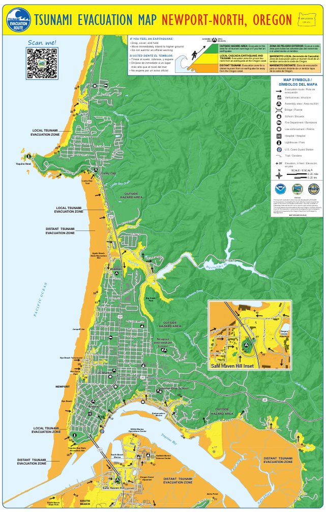

## Tsunamis – What to do in port
* When you’re in port (before, in between, or after a leg of the cruise) it is important to familiarize yourself with potential tsunami evacuation routes depending on where you are.
* Before you go on a planned outing, familiarize yourself with where you will be on the map and the best route for evacuation.
* Potential threats from a tsunami can vary drastically, so a little planning can go a long way to ensure the safety of oneself, and those around you.
* Maps are provided below for common ports. Make note of the docking location for the ship.
* Links are also provided for an online version of each port’s tsunami evacuation map.

::: {.panel-tabset}

### Newport, OR Tsunami Evacuation
* The map below is separated into Newport-North and Newport-South, with the Newport-North map for when you are north of the Yaquina Bay Bridge, and Newport-South for when you are south of the bridge.
* The ORANGE regions on the map represent the area that must be evacuated if there is a distant tsunami, in which the earthquake occurs far from the Oregon Coast.
* The YELLOW regions on the map represent the area that must be evacuated if there is a local Cascadia earthquake and tsunami that occurs on the Oregon Coast.
* The GREEN regions on the map represent the area that is outside the hazard area. Evacuate to the green if you there is a tsunami warning, if you feel an earthquake, OR if you are unsure about the risk for any reason.
* Remain in the evacuation zone until you are notified by authorities that it is safe to leave
* This [link](https://www.newportoregon.gov/emergency/evacmaps.asp) will take you to the same maps seen below. It will allow you to zoom in to identify where you are and evacuation areas around you.

::: {layout-ncol=2}

{width="60%"}

{width="60%"}

:::

### San Francisco, CA Tsunami Evacuation
* The map below does not provide as much detail as the Newport, OR map. 
* The link below will take you to the same map that is interactive. This allows you to identify your location and evacuation areas around you in greater detail than the map. 
* Wherever you might be in San Francisco, you will be less than 10 blocks from a safe area should a Tsunami occur. 
* The YELLOW on the map represents a tsunami hazard area and should be evacuated if you feel an earthquake, if you are given a tsunami warning, OR if you are unsure of the situation. 
* The GREEN on the map represents safe evacuation locations. 
* As San Francisco is a large city, if a localized earthquake/tsunami event were to occur, you should be aware of the dangers associated with evacuating to an area that has large buildings and other vulnerable structures. 
* Refer to this [link](https://maps.conservation.ca.gov/cgs/informationwarehouse/ts_evacuation/?extent=-13638549.0627%2C4536570.1047%2C-13622115.1016%2C4554762.1174%2C102100&utm_source=cgs+active&utm_content=sanfrancisco) for a much more detailed, interactive map to plan your safe evacuation route.

(insert SanFran map?)

### Seattle, WA Tsunami Evacuation
* Due to the terrain in and around Seattle, you are not far from safety should an earthquake/tsunami occur. 
* The map on the next page provides a different look at the tsunami hazard zones in Seattle. This map was created to show the potential levels of inundation from a tsunami associated with an earthquake along the Seattle Fault. As you can see, areas that have an inlet or cove represent the highest threat of inundation from a tsunami. 
* The GREEN on the map represents areas where inundation from a tsunami could be 0-0.5 meters. The YELLOW on the map represents areas where inundation from a tsunami could be 0.5-2.0 meters. The ORANGE on the map represents areas where inundation from a tsunami could be 2.0-5.0 meters. 
* While this map doesn’t actually show you where to go if a tsunami were to occur, it is an important reference depicting areas to avoid should an event occur. Should an earthquake, tsunami warning, or uncertainty involving an earthquake/tsunami occur, your first priority is to head for higher ground. 
* Follow this [link](https://www.pmel.noaa.gov/pubs/PDF/wals2794/wals2794.pdf) to find out more information about a potential earthquake/tsunami in Seattle.

(Insert seattle map?)
:::
